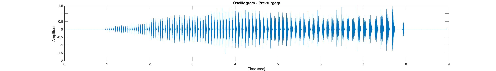
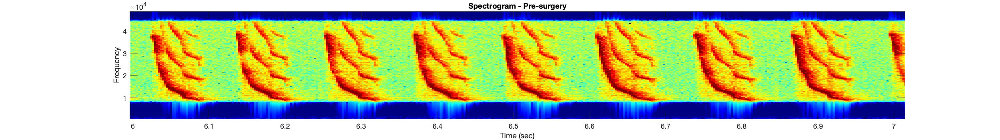

```{r setup, include = FALSE}
html_tag_audio <- function(file, type = c("wav")) {
  type <- match.arg(type)
  htmltools::tags$audio(
    controls = "",
    htmltools::tags$source(
      src = file,
      type = glue::glue("audio/{type}", type = type)
    )
  )
}
```

```{r}
knitr::opts_chunk$set(fig.path = "images/")
```

### Introduction

In my dissertation, I often work with acoustic sounds files. This sort of data is inherently difficult to present in a way that is intuitive to people who do not study acoustics because it requires translating something we experience using one sense, hearing, into another sensory modality, vision. In this project, I attempt to transform acoustic data into an intuitive visualization.

### Study system background

I study how singing mice (<em>Scotinomys teguina</em>) make sounds. These songs consist of a long series of rapidly-repeated notes, each of which start high-pitched, and sweep downwards to a lower pitch (technically this is a change in frequency).

These songs span a range of frequencies that is partially outside of human hearing. In fact, the older you get, the less of the song you can hear. Some older folks cannot hear these songs at all! Therefore, hearing these raw recordings with our ears only gives us some of the information transmitted by these mice.

Acoustic researchers typically depict sound recordings as spectrograms or oscillograms. Sound is just changes in pressure of a medium (air in the case of terrestrial organisms). Thus, one common way to depict sound is by showing changes in sound pressure across a time period (oscillogram). We often care about the frequency of the sound (how high does it sound to our ears?) which we can visualize using a spectrogram (time vs frequency). 

Before we do any visualization, let's listen to an example song from one individual. First I will play the song at normal speed.

Regular speed recording:
```{r}
html_tag_audio("audio/55-5-2_fast_pre.wav", type = "wav")
```

We are unable to perceive much of the frequency range these mice use and the rapid repetition of notes makes it hard to hear the frequency sweep.

Below, I have slowed down the song (5x), which not only allows us to hear each note more clearly, but also pitches down the song so it is completely within the range humans can perceive.

Slowed down song:
```{r}
html_tag_audio("audio/55-5-2_ss_pre.wav", type = "wav")
```

Now, let's visualize the song in a typical format using an oscillogram and spectrogram. The below plots were created in matlab where we do most of our song visualization and processing.

```{r echo=FALSE, out.width="100%"}


```

In the oscillogram (top figure), the longer lines show greater amplitude (louder). You can see that the beginning of the song is quieter than the rest of the song. In the spectrogram (bottom figure), each red line is a note that sweeps from a high to a low frequency. The color indicates the amplitude (red = high amplitude, green = low amplitude).

Let's look at a zoomed in version of the spectrogram to see the details of what these notes look like.

```{r echo=FALSE,out.width="100%"}

```

You can see that these notes contain a harmonic stack (multiple lines stacked on top of each other). The main thing that we pay attention to is the bottom line, also called the fundamental frequency. At this point in the song, each note spans from approximately 40,000 Hz down to 10,000 Hz in less than 0.1 seconds. 

# Visualization

## The idea

I want to represent three aspects of these audio files to the viewer. Mainly, I would like the viewer to intuitively understand amplitude (how loud sound is) and frequency (is it high or low?). I have decided to draw inspiration from symphony/choir conductors, who use visual cues to indicate changes in frequency and amplitude. To me, intuitively, frequency can be visualized on a vertical scale (higher frequencies = higher up in space) and amplitude by size (loud sounds are big, quiet sounds are small). So I am imagining a blob of some sort that goes up and down vertically and grows bigger or smaller with changing amplitude. But to make this really an experience like that of listening to a song, I want the temporal aspect of sound to be captured. To do this, I think I would like to make this visualization a video. This allows us to ephemerally experience each note before moving to the next one like we do when we hear sound. So, there will be a single blob or circle that will go up and down and grow bigger and smaller with changes in amplitude.

## Implementation

Video is just a series of images shown one right after the other at a particular frame rate. So to make this visualization, I am going to take a sound file and transform the amplitude information into size values and plot the frequency information on the y-axis. Then each value in the array will be used to create a single frame. Those frames will be stitched together and visualized.

This can be done by using ggplot2 (for plotting), gganimate (for animation), and gifski (for creating gifs). First I have to process some of the raw data. I have a file containing amplitude measurements across samples (my sampling frequency was 97656 samples per second) and a file containing frequency measures over time, but I had to generate these files using different software because of some technical issues. So I only ended up getting frequency measurements for a small chunk of the original data file (10 notes). So below, I trim the amplitude file to the matching time frame and resample it so that I can create one dataframe that has a frequency and amplitude measure for a given point in time. I also scale up the amplitude values (which are currently -1 to 1) so that I can more easily visualize the differences in amplitude on the final animation.

```{r}
library(tidyverse)
library(dplyr)

# import sound data
f <- "data/pre_amplitude.txt"
g <- "data/note_frequencies.csv"
# this is amplitudes for the whole song
amp_pre <- read_csv(f,col_names=TRUE)
# this contains frequency values only for ten notes from the song.
freq_pre <- read_csv(g,col_names=TRUE)
# find the right spot in the amplitude recording (multiplied time in sec of freq pre by sampling frequency to get # samples)
start <- as.numeric(round(freq_pre[1,1] * 97656))
end <- as.numeric(round(freq_pre[1575,1] * 97656))
# get amplitudes for just the range of time I have frequencies for
amp <- amp_pre[start:end,]
nums <- as.numeric(rownames(amp))
# transform samples into time in seconds
times <- 6.06441 + ((nums-1) * 0.00001024)
amp <- as.data.frame(cbind("time" = times, "amplitude" = amp$Amplitude)) # i have a higher sampling frequency for the amplitude measurements so I can't combine the amplitude dataframe with the frequency dataframe just yet. 
# only take the amplitude measurements every 50th sample
ampfreq_data <- amp[seq(1, nrow(amp), 49), ]
# join up the datasets and throw out rows where there are NA values
ampfreq_data$time <- round(ampfreq_data$time,5)
ampfreq <- left_join(freq_pre,ampfreq_data)
ampfreq <- na.omit(ampfreq)
table(is.na(ampfreq)) # yay no NAs!
# remove all rows that have zeros for frequency - this is necessary because there is an issue with the software parameters that I used to get the frequency values.
ampfreq <- ampfreq[-c(which(ampfreq$frequency == 0)),]
# need this for animating
ampfreq$transition_states <- c(1:nrow(ampfreq))
# scale up the amplitudes so that I can see the differences more clearly in the visualization
ampfreq$amplitude <- ampfreq$amplitude + 3
```

Now, I am ready to animate these data. Below, I create a ggplot object that plots time on the x axis and frequency on the y axis. The point size changes based on the amplitude. I squared the value and multiplied it by three so the differences among the amplitude would be more obvious. This point I chose in the song has pretty consistent amplitudes. I removed all the axis labels so we can just focus on how that dot moves in space and imagine what it sounds like. The transition_states() and transition_reveal() are gganimate functions that dictate what aspect of the plots are changing and in what order. Finally animate() renders the animation at a user supplied number of frames and frame rate. I slowed down the frame rate a bit so that we could see the changes occuring over these notes.

```{r}
library(ggplot2)
library(gganimate)
library(gifski)


anim <- ggplot(data=ampfreq,aes(x=time,y=frequency)) + geom_point(aes(size = 3 * (amplitude)^2)) + scale_radius() + 
  theme_bw() + theme(legend.position="none",
                     axis.text.x = element_blank(), #remove x axis labels
                     axis.ticks.x = element_blank(), #remove x axis ticks
                     axis.text.y = element_blank(),  #remove y axis labels
                     axis.ticks.y = element_blank(),  #remove y axis ticks
                     axis.title = element_blank(), # remove axes labels
                     panel.grid = element_blank(), # remove grid
                     panel.border = element_blank()) + # remove the border around the plot
  transition_states(transition_states) + transition_reveal(time)

animate(plot=anim,nframes = 700,fps = 20)
```

The animation is not perfect because the frequency measures were a bit flawed (due to the software detecting other sounds in the recording). The amplitude is pretty consistent across these notes so that amplitude changes are also not super clear. However, I think this does give some sense of the downward sweeping nature of the notes in terms of their frequency which is nice.